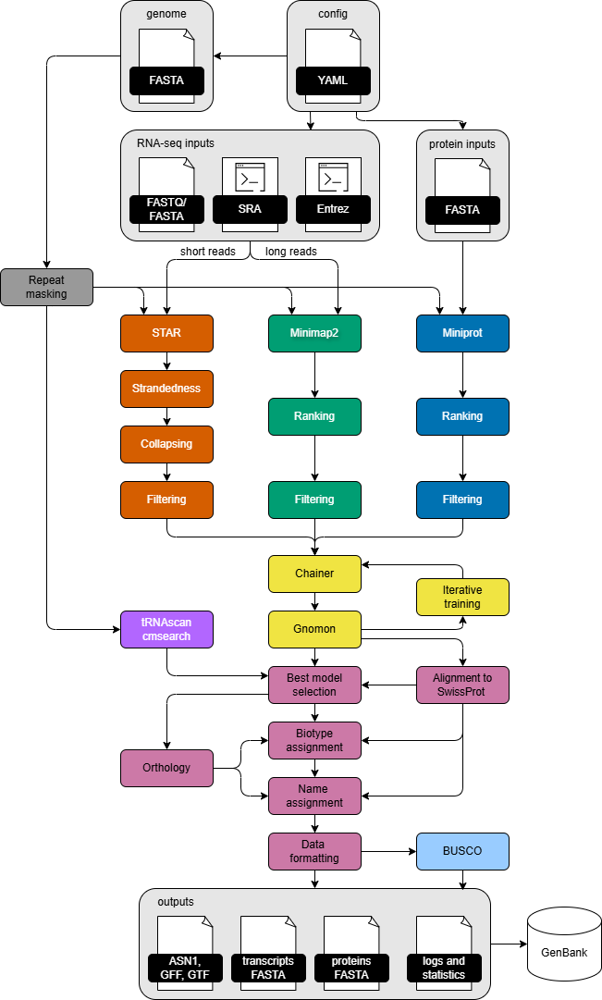
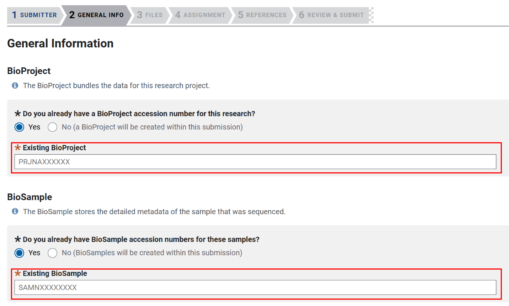
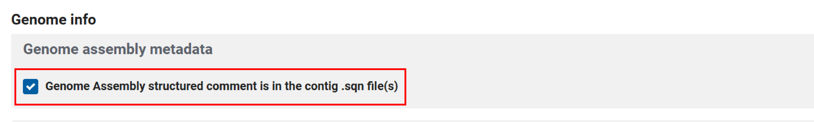
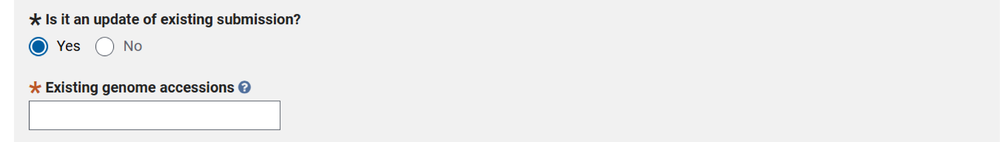
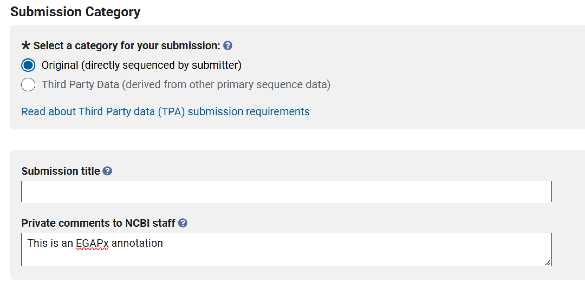
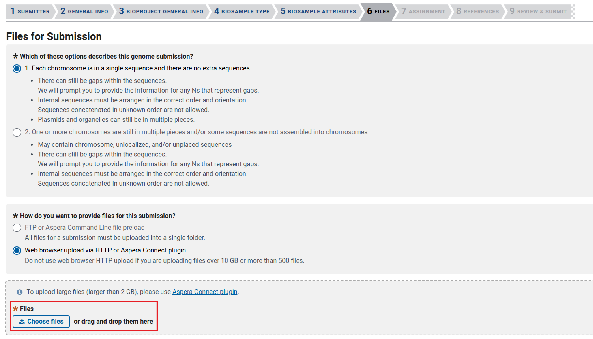
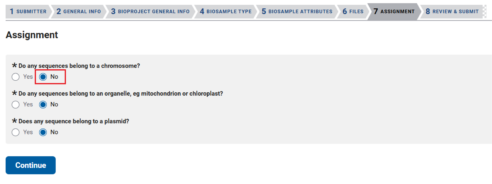

# Eukaryotic Genome Annotation Pipeline - External (EGAPx) 

EGAPx is the publicly accessible version of the updated NCBI [Eukaryotic Genome Annotation Pipeline](https://www.ncbi.nlm.nih.gov/refseq/annotation_euk/process/). 

EGAPx takes an assembly FASTA file, a taxid of the organism, and RNA-seq data. Based on the taxid, EGAPx will pick protein sets and HMM models. The pipeline runs `miniprot` or `prosplign` to align protein sequences, `STAR` to align short RNA-seq reads, and `minimap2` to align long RNA-seq reads to the assembly. Protein alignments and RNA-seq read alignments are then passed to `Gnomon` for gene prediction. In the first step of `Gnomon`, the short alignments are chained together into putative gene models. In the second step, these predictions are further supplemented by _ab-initio_ predictions based on HMM models. Functional annotation is added to the final structural annotation set based on the type and quality of the model and orthology information. Optionally, noncoding RNAs (tRNAs, rRNAs, snoRNAs and snRNAs) can be predicted using `tRNAscan` and `cmsearch`. The final output includes annotationed features in ASN format which can be used to prepare GenBank annotation [submissions](#submitting-egapx-annotation-to-ncbi) using the included `prepare_submission` script, as well as annotation in GFF3 format for pre-submission analysis and easier modification of predicted features. 

We currently have protein datasets posted that are suitable for most vertebrates, arthropods, echinoderms, and some plants:
  - Chordata - Mammalia, Sauropsida, Actinopterygii (ray-finned fishes), other Vertebrates
  - Insecta - Hymenoptera, Diptera, Lepidoptera, Coleoptera, Hemiptera 
  - Arthropoda - Arachnida, other Arthropoda
  - Echinodermata
  - Cnidaria

  - Monocots - Liliopsida
  - Eudicots - Asterids, Rosids, Fabids, Caryophyllales
  

:warning: Fungi, protists and nematodes are out-of-scope for EGAPx. We recommend using a different annotation method for these organisms.

**Security Notice:**
EGAPx has dependencies in and outside of its execution path that include several thousand files from the [NCBI C++ toolkit](https://www.ncbi.nlm.nih.gov/toolkit), and more than a million total lines of code. Static Application Security Testing has shown a small number of verified buffer overrun security vulnerabilities. Users should consult with their organizational security team on risk and if there is concern, consider mitigating options like running via VM or cloud instance. 

**License:**
See the EGAPx license [here](https://github.com/ncbi/egapx/blob/main/LICENSE).



# Contents 
<!-- TOC -->

- [Prerequisites](#prerequisites)
- [Installation and setup](#installation-and-setup)
- [Input data format](#input-data-format)
  - [Running EGAPx with short RNA-seq reads](#running-egapx-with-short-rna-seq-reads)
  - [Running EGAPx with long RNA-seq reads](#running-egapx-with-long-rna-seq-reads)
  - [Protein aligner and protein evidence set selection](#protein-aligner-and-protein-evidence-set-selection)
  - [Noncoding RNA feature prediction](#noncoding-rna-feature-prediction)
- [Input example](#input-example)
- [Run EGAPx](#run-egapx)
  - [CPU, memory, and executors configuration](#cpu-memory-and-executors-configuration)
  - [Online mode](#online-mode)
  - [Offline mode](#offline-mode)
- [Output](#output)
- [Interpreting Output](#interpreting-output)
- [Intermediate files](#intermediate-files)
- [Modifying default parameters](#modifying-default-parameters)
- [Submitting EGAPx annotation to NCBI](#submitting-egapx-annotation-to-ncbi)
  - [Prepare required files and metadata](#prepare-required-files-and-metadata)
  - [Submitting annotation with a new assembly](#submitting-annotation-with-a-new-assembly)
  - [Submitting annotation for an existing GenBank assembly](#submitting-annotation-for-an-existing-genbank-assembly)
  - [Review output for submission readiness](#review-output-for-submission-readiness)
- [FAQ](#faq)
- [References](#references)
- [Contact us](#contact-us)

<!-- /TOC -->


## Prerequisites
[Back to Top](#Contents)

- Docker or Singularity  
- AWS batch, SLURM/UGE cluster, or a r6a.4xlarge machine (32 CPUs, 256GB RAM) 
- Nextflow v.23.10.1
- Python v.3.11+ 

Notes:
- General configuration for AWS Batch is described in the Nextflow documentation at https://docs.seqera.io/nextflow/aws
- See Nextflow installation at https://docs.seqera.io/nextflow/install

## Installation and setup
[Back to Top](#Contents)

  ```
  git clone https://github.com/ncbi/egapx.git
  cd egapx

  python3 -m venv venv
  source venv/bin/activate
  pip install -r requirements.txt
  ```

## Input data format
[Back to Top](#Contents)

Input to EGAPx is in the form of a YAML file. 

- The following are the _required_ fields:

  ```
  genome: path to assembled genome in FASTA format
  taxid: NCBI Taxonomy identifier of the target organism 
  ```
  - See [here](#input-genome) for genome FASTA requirements/recommendations
  - You can obtain taxid from the [NCBI Taxonomy page](https://www.ncbi.nlm.nih.gov/taxonomy).

- Running EGAPx with RNA-seq ([short reads](#running-egapx-with-short-rna-seq-reads), [long reads](#running-egapx-with-long-rna-seq-reads), [combination](#running-egapx-with-long-rna-seq-reads)) is highly recommended.

### Input genome
[Back to Top](#Contents)

- The assembled genome should be in FASTA [format](https://www.ncbi.nlm.nih.gov/genbank/fastaformat/). Sequence titles and some special characters are allowed in the FASTA definition line, but shorter and simpler names are less likely to cause issues.
- The genome sequence does not need to be repeat-masked prior to annotation. EGAPx performs masking steps as part of the pipeline.
- :warning: The assembled genome should be screened for contamination prior to running EGAPx. See the NCBI [Foreign Contamination Screen](https://github.com/ncbi/fcs) for a fast, user-friendly contamination screening tool. 
- We recommend keeping organelle sequences in the genome FASTA to prevent inaccurate read mapping, but EGAPx does not support organelle annotation.

### Running EGAPx with short RNA-seq reads
[Back to Top](#Contents)

RNA-seq short reads data can be supplied from SRA accessions and/or from non-SRA data. If using both, SRA reads need to be downloaded locally first.
- NCBI SRA datasets can be specified as an array:
   ```
   short_reads:
     - SRR8506572
     - SRR9005248
   ```

- To specify an SRA entrez query:
    ```
    short_reads: txid43150[Organism] AND 50:350[ReadLength] AND (illumina[Platform] OR bgiseq[Platform]) AND biomol_rna[Properties]
    ```   

  **Note:** Some SRA entrez query can return a large number of SRA run id's. To prevent EGAPx from using a large number of SRA runs, please run the query first at the [NCBI SRA page](https://www.ncbi.nlm.nih.gov/sra). If there are too many SRA runs, then select a few of them and list it in the input yaml.

- If you are using non-SRA reads, the recommended input formatting is a nested list of read set names and paths or a list of read set names and paths in a separate file. Reads from individual sequencing runs should be provided as separate files, never combined. For smaller RNA-seq datasets, you can follow the nested list format below. Here the filenames for the reads can be anything, but the set names for each set has to be unique. 
    ```
    short_reads:
     - - single_end_library_name1   # set name
       - - path/to/se1_reads.fq     # file for single-end reads
     - - single_end_library_name2
       - - path/to/se2_reads.fq
     - - paired_end_library_name1   # set name  
       - - path/to/pe1_reads_R1.fq  # file for paired-end R1 reads
         - path/to/pe1_reads_R2.fq  # file for paired-end R2 reads
     - - paired_end_library_name2
       - - path/to/pe2_reads_R1.fq
         - path/to/pe2_reads_R2.fq
    ```
    
- For a large number of local RNA-seq runs, you can list them in a file with a set name and a filepath in each line:
    ```
    seset1 path/to/se1_reads_R1.fq # file for single-end reads
    peset1 path/to/pe1_reads_R1.fq # file for paired-end R1 reads
    peset1 path/to/pe1_reads_R2.fq # file for paired-end R2 reads
    peset2 path/to/pe2_reads_R1.fq
    peset2 path/to/pe2_reads_R2.fq
    ```
    Then you can read that file from the input yaml
    ```
    short_reads: path/to/reads.txt
    ```
    See `examples/input_D_farinae_small_reads.txt`) and `examples/input_D_farinae_small_readlist.yaml` for an example using this strategy.

- If you are using both SRA and non-SRA data, SRA reads need to be downloaded locally first and provided as paths:
    ```
    SRRXXXXXXX path/to/SRRXXXXXXX_1.fq
    SRRXXXXXXX path/to/SRRXXXXXXX_2.fq
    peset1 path/to/pe1_reads_R1.fq
    peset1 path/to/pe1_reads_R2.fq
    ```

### Running EGAPx with long RNA-seq reads
[Back to Top](#Contents)

RNA-seq long reads data can be provided alone or in combination with short reads data. Long reads are supplied from SRA accessions and/or from non-SRA data (FASTA or FASTQ, not BAM). If using both, SRA reads need to be downloaded locally first.
- Use the same formatting structure described above for short reads with the label `long_reads:`
  ```
  genome: path to assembled genome in FASTA format
  taxid: NCBI Taxonomy identifier of the target organism 
  short_reads: RNA-seq short reads data
  long_reads: RNA-seq long reads data
  ```
  - See `examples/input_Hirundo_rustica.yaml` for an example.

- To specify an SRA entrez query:
    ```
    short_reads: txid43150[Organism] AND 50:350[ReadLength] AND (illumina[Platform] OR bgiseq[Platform]) AND biomol_rna[Properties]
    long_reads: txid43150[Organism] AND (oxford_nanopore[Platform] OR pacbio_smrt[Platform]) AND biomol_rna[Properties]
    ```
- We have not rigorously tested EGAPx performance using clustered vs. non-clustered IsoSeq reads. EGAPx uses read depth for filtering and removing rare isoforms with limited support, but clustered reads will reduce compute cost.

### Protein aligner and protein evidence set selection
[Back to Top](#Contents)

By default, EGAPx uses `miniprot` to align protein sets to the genome. Optionally, the user can specify the `prosplign` aligner. From internal testing, `prosplign` has resulted in slight increases in annotation accuracy but is computationally more expensive. `prosplign` may be particularly useful in cases where there is little to no RNAseq evidence available. 

- To specify the `prosplign` aligner:
    ```
    protein_aligner_name: prosplign
    ```
- To specify the number of protein sets retrieved and aligned (defaults `miniprot : 10`; `prosplign : 5`):
    ```
    proteins_best_n_orgs: 10
    ```
- To add custom protein sets to target set:
    ```
    additional_proteins: proteins.fa
    ```
- To exclude specific taxids from target set:
    ```
    proteins_deny_taxids: 7227, 7240
    ```
    OR
    ```
    proteins_deny_taxids:
      - 7227
      - 7240
    ```

### Noncoding RNA feature prediction
[Back to Top](#Contents)

By default, EGAPx predicts ribosomal RNAs using the [Rfam](https://rfam.org/) database. Optionally, you can enable prediction of other types of noncoding RNA features.

- To enable prediction of tRNA features using [tRNAscan](https://github.com/UCSC-LoweLab/tRNAscan-SE):
    ```
    trnascan:
      enabled: true
    ```
- To enable prediction of rRNAs, snoRNAs and snRNAs by searching the [RFAM](https://rfam.org/) database using cmsearch distributed in [Infernal](https://github.com/EddyRivasLab/infernal):
    ```
    cmsearch:
      enabled: true
    ```

## Run EGAPx
[Back to Top](#Contents)

Based on Internet access from the submit/main node and worker nodes, EGAPx can be configured to run in [online](#online-mode) or [offline](#offline-mode) mode. To test the pipeline, an example YAML file `./examples/input_D_farinae_small.yaml` is included in the `egapx` folder. Here, the RNA-seq data is provided as paths to the reads FASTA files. These FASTA files are a sampling of the reads from the complete SRA read files to expedite testing. This example usually runs under 30 minutes depending upon resource availability.

  ```
  genome: https://ftp.ncbi.nlm.nih.gov/genomes/all/GCA/020/809/275/GCA_020809275.1_ASM2080927v1/GCA_020809275.1_ASM2080927v1_genomic.fna.gz
  taxid: 6954
  short_reads:
   - - SRR8506572
     - - https://ftp.ncbi.nlm.nih.gov/genomes/TOOLS/EGAP/sample_data/Dermatophagoides_farinae_small/SRR8506572.1
       - https://ftp.ncbi.nlm.nih.gov/genomes/TOOLS/EGAP/sample_data/Dermatophagoides_farinae_small/SRR8506572.2
   - - SRR9005248
     - - https://ftp.ncbi.nlm.nih.gov/genomes/TOOLS/EGAP/sample_data/Dermatophagoides_farinae_small/SRR9005248.1
       - https://ftp.ncbi.nlm.nih.gov/genomes/TOOLS/EGAP/sample_data/Dermatophagoides_farinae_small/SRR9005248.2
  ```
### Executors, memory, and CPU configuration
[Back to Top](#Contents)

- Run EGAPx for the first time to generate the config files so you can edit them:
  ```
  python3 ui/egapx.py ./examples/input_D_farinae_small.yaml -e <executor> -w <workdir> -o <output>
  ```
  - This will create a `./egapx_config` directory containing the template config files.  
  - :warning: You'll need to edit these templates to suit your specific environment:
    - For AWS Batch execution, set up AWS Batch Service following the process [here](https://www.nextflow.io/docs/latest/aws.html). Then edit the value for `process.queue` in `./egapx_config/aws.config` file.
    - Some executors, e.g. `-e docker` and `-e singularity` default to running on a single node
    - For execution on the local machine you don't need to adjust anything.

    - use `-e aws` for AWS batch using Docker image
    - use `-e docker` for using Docker image
    - use `-e singularity` for using the Singularity image
    - use `-e biowulf_cluster` for Biowulf cluster using Singularity image
    - use `-e slurm` for using SLURM in your HPC.
        - Note that for this option, you have to edit `./egapx_config/slurm.config` according to your cluster specifications.
    - type `python3 ui/egapx.py  -h ` for the help menu

- The default memory and CPU configuration is at `./egapx_config/process_resources.config`
- The default configuration has tested successfully for: 
  - 1.7 Gb snake genome with 15 short-read SRA datasets (~600M reads, ~60Gb) and 2 long-read SRA datasets (~30M reads, ~80Gb)
  - 3 Gb human genome with 10 short-read SRA datasets (~740M reads, ~75Gb)

- EGAPx automatically configures CPU resources based on the parameters below, which you can customize for your compute environment:
  ```
  params.threads = 16
  params.nodes = 16
  params.num_cpus_per_node = 96
  ```

- EGAPx Nextflow processes are assigned labels with memory limits that should work for most annotations. Large genomes and/or large RNA-seq datasets may require editing the resource allocation for egapx. Examples you can try:
  ```
    withLabel: 'small_mem' { 
        memory = 8.GB
    }
    withLabel: 'med_mem' {
        memory = 64.GB --> change to 128.GB 
    }
    withLabel: 'large_mem' { 
        memory = 128.GB --> change to 200.GB
    }
  ```
- Exceptionally large genomes may require additional parameter specifications. EGAPx annotation on a large 40 Gb lungfish genome required the following changes in `./ui/assets/default_task_params.yaml`, with the change in miniprot potentially reducing alignment sensitivity:
  ```
  star_index:
    STAR: --runThreadN 8 --limitGenomeGenerateRAM 150000000000 --genomeSAsparseD 3
  miniprot:
    split_proteins: -n 25000
    miniprot: -p 0.4 --outs=0.4 -M 3
  ```

### Online mode
[Back to Top](#Contents)

In online mode, support files are automatically staged before EGAPx pipeline execution.

- After configuration files are finalized, run the EGAPx pipeline:
  ```
  python3 ui/egapx.py ./examples/input_D_farinae_small.yaml -e <executor> -w <workdir> -o <output>
  ```

### Offline mode
[Back to Top](#Contents)

In offline mode, you download the necessary files from NCBI FTP and the BUSCO website using `egapx.py` script, then use the path of the downloaded folder in the run command. This mode is useful if your Internet access is more restricted or you want reproducible runs with controlled local data.

- Download all EGAPx support files, relevant BUSCO lineage files, and SRA data:
  ```
  python3 ui/egapx.py ./examples/input_D_farinae_small.yaml -dl -lc local_cache
  ```
- Alternatively, download only relevant EGAPx support files and BUSCO lineage files, and SRA data:
  ```
  python3 ui/egapx.py ./examples/input_D_farinae_small.yaml -dn -lc local_cache
  ``` 
- Download subsampled SRA data:
  ```
  mkdir local_cache/sra_dir
  curl https://ftp.ncbi.nlm.nih.gov/genomes/TOOLS/EGAP/sample_data/Dermatophagoides_farinae_small/SRR8506572.[1-2] -o 'local_cache/sra_dir/SRR8506572_#1.fasta'
  curl https://ftp.ncbi.nlm.nih.gov/genomes/TOOLS/EGAP/sample_data/Dermatophagoides_farinae_small/SRR9005248.[1-2] -o 'local_cache/sra_dir/SRR9005248_#1.fasta'
  ```
- Edit the EGAPx YAML:
  ```
  genome: https://ftp.ncbi.nlm.nih.gov/genomes/all/GCA/020/809/275/GCA_020809275.1_ASM2080927v1/GCA_020809275.1_ASM2080927v1_genomic.fna.gz
  taxid: 6954
  short_reads:
   - - SRR8506572
     - - /path/to/local_cache/sra_dir/SRR8506572_1.fasta
       - /path/to/local_cache/sra_dir/SRR8506572_2.fasta
   - - SRR9005248
     - - /path/to/local_cache/sra_dir/SRR9005248.1.fasta
       - /path/to/local_cache/sra_dir/SRR9005248.2.fasta
  ```
- Run EGAPx:
  ```
  python3 ui/egapx.py edit_D_farinae_small.yaml -e <executor> -w <workdir> -o <output> -lc local_cache
  ```
- For EGAPx runs using full SRA datasets, if [fasterq-dump](https://github.com/ncbi/sra-tools/wiki/HowTo:-fasterq-dump) is available and the input yaml file has a list of SRA runs, `egapx.py` will download those SRA runs too and place them at `../local_cache`. When you start your egapx run using the same input yaml, and provide the local cache, it will look for those SRA run files in the local cache directory. Alternately, you can download full SRA runs yourself using the commands below, then edit the EGAPx YAML to provide paths to the local files:
  ```
  prefetch SRR8506572
  prefetch SRR9005248
  fasterq-dump --skip-technical --threads 6 --split-files --seq-defline ">\$ac.\$si.\$ri" --fasta -O sradir/  ./SRR8506572
  fasterq-dump --skip-technical --threads 6 --split-files --seq-defline ">\$ac.\$si.\$ri" --fasta -O sradir/  ./SRR9005248
  ```

## Output
[Back to Top](#Contents)

A successful EGAPx run will produce a completion message and basic feature [statistics](#interpreting-output):
```
python3 ui/egapx.py ./examples/input_D_farinae_small.yaml -e <executor> -w <workdir> -o <output>

Completed at: 01-Dec-2025 10:50:32
Duration    : 1h 22m 12s
CPU hours   : 6.3
Succeeded   : 134
```

The output directory contains several files: 

| File                                     | Description                                    |
|------------------------------------------|------------------------------------------------|
| *Sequence and Annotation Files:*|
| `annotated_genome.asn`| Final annotation set in ASN1 format|
| `complete.genomic.gff`                   | Final annotation set in GFF3 format |            
| `complete.genomic.gtf`| Final annotation set in GTF format|
| `complete.genomic.fna`| Full genome sequences set in FASTA format|
| `complete.cds.fna`| Annotated Coding DNA Sequences (CDS) in FASTA format|
| `complete.transcripts.fna`| Annotated transcripts in FASTA format (includes UTRs)|
| `complete.proteins.faa`| Annotated protein products in FASTA format|
|*Logs and Miscellaneous Outputs:* |
| `annotation_data.cmt`| Annotation structured comment file - used for submission to GenBank|
| `sra_metadata.dat`| metadata file containing information about SRA runs used for the EGAPx run|
| `GNOMON`| Directory containing Gnomon annotation reports and `contam_rpt.tsv` contamination report|
| `busco`| Directory containing BUSCO results|
| `nextflow`| Directory containing Nextflow run reports|
| `stats`| Directory containing features statistics for the final annotation set|
| `validated`| Directory containing validation warnings and errors for annotated features - used for submission to GenBank|
|*Nextflow Logs in* `nextflow` *directory:*|
| `nextflow.log`| Main Nextflow log that captures all the process information and their work directories|
| `resume.sh`| Nextflow command for resuming a run from the last successful task|
| `run.report.html`| Nextflow rendered HTML execution report containing run summary, resource usage, and tasks execution|
| `run.timeline.html`| Nextflow rendered HTML timeline for all processes executed in the EGAPx pipeline|
| `run.trace.txt`| Nextflow execution tracing file that contains information about each EGAPx process including runtime and CPU usage|
| `run_params.yaml`| YAML file containing parameters used for the EGAPx run|

## Interpreting Output
[Back to Top](#Contents)

**Feature counts**

When an EGAPx run is completed, summary statistics for annotated features are printed to terminal:

```
Overall Counts:
  genes: 12650
    genes (non-transcribed pseudo): 215
    genes (has variants): 4212
    genes (partial): 85
    genes (Ig TCR segment): 0
    genes (non coding): 886
    genes (protein coding): 11549
    genes (major correction): 196
    genes (premature stop): 49
    genes (has frameshifts): 164
  mRNAs: 23281
    mRNAs (exon <= 3nt): 1
    mRNAs (partial): 85
    mRNAs (correction): 196
    mRNAs (model): 23281
    mRNAs (fully supported): 21577
    mRNAs (ab initio > 5%): 1070
  non-coding RNAs: 1963
    non-coding RNAs (exon <= 3nt): 0
    non-coding RNAs (model): 1963
    non-coding RNAs (fully supported): 1963
  pseudo transcripts: 215
    pseudo transcripts (exon <= 3nt): 0
    pseudo transcripts (model): 215
    pseudo transcripts (fully supported): 56
    pseudo transcripts (ab initio > 5%): 0
  CDSs: 23281
    CDSs (partial): 85
    CDSs (correction): 196
    CDSs (model): 23281
    CDSs (fully supported): 21577
    CDSs (ab initio > 5%): 1144
    CDSs (model with correction): 196
    CDSs (major correction): 196
    CDSs (premature stop): 49
    CDSs (has frameshifts): 164
```

:warning: Genes with `major correction` are likely protein-coding genes with frameshifts and/or internal stops. These models include "LOW QUALITY PROTEIN" in the protein FASTA title, are marked up with exception=low-quality sequence region on the mRNA and CDS features, and the annotation is adjusted to meet GenBank criteria (frameshifts are compensated for by 1-2 bp microintrons in the mRNA and CDS features, and internal stops have a transl_except to translate the codon as X instead of a stop). For RefSeq, we set a threshold of no more than 10% of protein-coding genes with major corrections to release the annotation. We recommend users polish assembly sequences if the rate is higher than 10%.

Counts of protein-coding genes should be considered versus similar species. Low counts may result from insufficient supporting evidence (e.g. low RNAseq coverage or an unusual organism compared to the available protein data). High counts may indicate genome fragmentation, uncollapsed haplotypic duplication, or noise from genes annotated on transposons.


**Feature counts** `stats/feature_counts.xml`

This file contains summary counts of features by model prediction categories determined by Gnomon. This file is the source of feature counts printed to terminal when an EGAPx run is completed.

**Feature stats** `stats/feature_stats.xml` 

This file contains summary statistics of transcript counts per gene, exon counts per transcript, and the counts and length distributions of features by sub-type.

**BUSCO report** `busco/short_summary*.txt`

[BUSCO](https://busco.ezlab.org/) is performed as part of an EGAPx run. The `taxid` parameter specified in the input YAML is used to determine the appropriate BUSCO lineage. BUSCO is run in proteins mode on the longest isoform per gene.

You can search for a relevant taxonomic group of interest on [NCBI Datasets](https://www.ncbi.nlm.nih.gov/datasets/genome/) or other databases (e.g. [Genomes on a Tree](https://goat.genomehubs.org/), [A3Cat](https://a3cat.unil.ch/plots.html)) to find the expected BUSCO content for your organism. Low BUSCO scores could indicate issues with assembly quality. Low BUSCO scores may also occur in organisms that are divergent from the set of organisms used to construct the BUSCO models.

**Contamination report** `GNOMON/contam_rpt.tsv`

Following structural annotation with Gnomon, gene models are processed by the `gnomon_biotype` program to assign models as protein coding, non-coding, and pseudogenes. As part of this process, models are
searched against the SwissProt database using `diamond blastp`. If sufficient models have best BLAST hits to prokaryotes or viruses (currently >=5%), the EGAPx pipeline will fail with the error message `Error: (CException::eUnknown) Too many protein hits to proks`, indicating the assembly is likely to be extensively contaminated.

We strongly recommend pre-screening your assembly with FCS (https://github.com/ncbi/fcs) before annotation. However, in some cases FCS may miss contamination that is detected by gnomon_biotype since protein-protein comparisons can be more sensitive than the nucleotide-based approach used in FCS. To help in these cases, EGAPx produces a contamination report `contam_rpt.tsv` that summarizes counts of gene models for each sequence, including counts of gene models with best hits to prokaryotes or viruses:

```
1: #seq_id                      genomic sequence identifier
2: gb_syn_seq_id                GenBank synonym seq-id, 'na' for EGAPx runs
3: length                       total sequence length
4: num_genes                    total number of gene models present on the sequence
5: num_single_exon_genes        total number of single-exon gene models present on the sequence
6: num_prok_genes               number of gene models with best hits to prokaryotes/virus
7: num_prok_single_exon_genes   number of single-exon models with best hits to prokaryotes/virus
```

Users can review this report to identify longer contigs with a high fraction of bacteria (especially single-exon) models. Note short sequences with few models can be a source of both false positives and false negatives, so generally more analysis is needed. One starting strategy is to filter sequences with at least 10 models (col 4) where at least 50% of models have best hits to prokaryotes/viruses (col 6), identify candidate contaminating genomes using megablast/blastx, then search against your genome again in more detail using contaminant genomes as queries using dc-megablast.

**Gnomon report** `GNOMON/new.gnomon_report.txt`

This report provides a detailed summary of the evidence supporting each transcript model constructed by Gnomon. Models are constructed by chaining together sets of splice-compatible alignments optimized based on overall coding propensity and expression levels aiming to represent full length transcripts. Each model is typically supported by one or more lines of evidence (proteins, long read RNA-seq, short read RNA-seq), with each line of evidence reported as a separate row per model. Short read RNA-seq is reported as aggregate data per sample when supplying reads from SRA. Partial protein-coding models may also be supplemented by *ab initio* analysis, which is also reported as a line of evidence. Columns are:

```
 1: transcript_id                     final transcript identifier for the model, if retained as a transcript in the final annotation
 2: Gnomon model                      initial gnomon identifier
 3: Scaffold id                       genomic sequence identifier
 4: Evidence id                       evidence identifier
 5:                                   set to NA, column is not currently populated in EGAPx
 6:                                   set to NA, column is not currently populated in EGAPx
 7:                                   set to NA, column is not currently populated in EGAPx
 8: Alignment Percent Identity        percent identity for protein alignments. Set to NA if line of evidence is RNA-seq or ab initio predictions
 9: Base Coverage Percentage          percent of the transcript model covered by this line of evidence
10: CDS Base Coverage Percentage      percent of the transcript model CDS region covered by this line of evidence
11: Precise splice-site support       fraction of the total number of introns with support from this line of evidence
12: Approximate splice-site support   fraction of the total number of introns with support close to (within 5 bp) this line of evidence
13: Core Support                      whether the line of evidence is part of the minimal set of evidence constructing the model. Y=Yes, N=No, NA=Not applicable. Set to NA for sample-based short RNA-seq rows (col 4 format gnl|SRA|<sample>) or ab initio rows
14: In Minimal Full Introns Support   whether the line of evidence is part of the minimal set of evidence supporting all introns of the model. Y=Yes, N=No, NA=Not applicable. Set to NA for ab initio rows
```

Lines of evidence with the highest coverage of splice sites (col 11) and highest coverage (col 9 and col 10) are providing the strongest support.

**Gnomon quality report** `GNOMON/new.gnomon_quality_report.txt`

This report provides a summary of the evidence supporting each RNA model constructed by Gnomon, with a single row per model. Columns are:

```
 1: transcript_id                              final transcript identifier for the model, if retained as a transcript in the final annotation
 2: Gnomon model                               initial gnomon identifier
 3: Scaffold id                                genomic sequence identifier
 4: Minimal Full Support                       minimum number of alignments needed to construct the model. Short RNA-seq alignments are counted individually
 5: Minimal Same-species Full Support          like col 4, but ignoring protein alignments which are generally cross-species
 6: Minimal Full Intron Support                like col 4, but limited to just the model's introns. Set to NA if the model is unspliced
 7: Minimal Same-species Full Intron Support   like col 5, but limited to just the model's introns. Set to NA if the model is unspliced
 8: Average Base Same-Species Support          average short-read RNA-seq read depth across the model
 9: Smallest Base Same-Species Support         minimum short-read RNA-seq read depth across the model
10: Average Intron Same-Species Support        average short-read RNA-seq read depth across all introns of the model. Set to NA if the model is unspliced
11: Smallest Intron Same-Species Support       minimum short-read RNA-seq read depth across all introns of the model. Set to NA if the model is unspliced
12: Number Introns Same-Species Support        total number of introns with transcript support. Set to NA if the model is unspliced
13: Ab Initio Percentage                       percentage of the transcript model predicted by ab initio
14: SRS Base Support Percentage                percentage of the transcript model with short read RNA-seq support
15: Full intron support SRS count              number of short read RNA-seq biosamples supporting all introns of the model. Set to NA if the model is unspliced
16: Partial intron support SRS count           number of short read RNA-seq biosamples supporting some but not all introns of the model. Set to NA if the model is unspliced
17: Non-consensus introns                      fraction of the total number of introns with non-consensus (not GT-AG, GC-AG, or AT-AC) splice sites
18:                                            set to NA, column is not currently populated in EGAPx
19:                                            set to NA, column is not currently populated in EGAPx
20: SRS Base Support Percentage Unambiguous    like col 14, but restricted to uniquely mapped short read RNA-seq alignments
```

The best models have no *ab initio* contributions (col 13), high RNA-seq coverage (col 14), and a low number of alignments needed for the minimal intron set (col 6). 

## Intermediate files
[Back to Top](#Contents)

In the nextflow log, you can find work directory paths for each job. You can go to that path, and look for the output files and command logs. For example, to see the files generated during run_miniprot job, run the following command to get the directory path, and list the files within that directory.

```
grep run_miniprot example_out/nextflow.log| grep COMPLETED

aws s3 ls s3://temp_datapath/D_farinae/86/68836c310a571e6752a33a221d1962/
                           PRE output/
2024-10-30 10:54:36          0 
2024-10-30 10:59:04          6 .command.begin
2024-10-30 10:59:33        780 .command.err
2024-10-30 10:59:35        780 .command.log
2024-10-30 10:59:32          0 .command.out
2024-10-30 10:54:36      13013 .command.run
2024-10-30 10:54:36        139 .command.sh
2024-10-30 10:59:33        277 .command.trace
2024-10-30 10:59:34          1 .exitcode

aws s3 ls s3://ncbi-egapx-expires/work/D_farinae/86/68836c310a571e6752a33a221d1962/output/
2024-10-30 10:59:34   26539116 1.paf
```


## Modifying default parameters
[Back to Top](#Contents)

The default task parameter values are listed in the file `ui/assets/default_task_params.yaml`. If there are cases where you need to change some task parameters from the default values, you can add those to the input yaml file.  

For example, if you're using RNA-seq from species besides the one being annotated, you can relax the alignment criteria by setting the following parameters in your input yaml:

```
tasks:
  rnaseq_collapse:
    rnaseq_collapse: -high-identity 0.8
  convert_from_bam:
    sam2asn: -filter 'pct_identity_gap >= 85'
  star_wnode:
    star_wnode: -pct-identity 85
```
To change the `max_intron` value from what egapx calcuates, you can set it as:
```
max_intron: 700000
```

## Submitting EGAPx annotation to NCBI
[Back to Top](#Contents)

After annotating your genome with EGAPx, you can prepare your annotation for submission to NCBI.

### Prepare required files and metadata

You will need:

- EGAPx annotation output in ASN1 format `out/annotated_genome.asn` 
- Submission template file prepared from https://submit.ncbi.nlm.nih.gov/genbank/template/submission/
- BioProject / BioSample / locus_tag prefix
  - To submit annotation with new assemblies, register BioProject/BioSample at https://submit.ncbi.nlm.nih.gov/subs/bioproject/ and you will be assigned a locus_tag prefix. Use both in the `prepare_submission` command
  - To submit annotation for existing GenBank assemblies, you can access the BioProject information on Datasets Genome pages by searching the assembly accession at https://www.ncbi.nlm.nih.gov/datasets/genome/. locus_tag prefix is not needed in your `prepare_submission` command 

- To submit annotation with new assemblies, you will need additional inputs:
  - Source modifiers table file (see `examples/example_source_table.src`)
    - Tab-delimited file containing sequence identifiers, chromosome names, location, topology
    - Chromosome names follow these [rules](https://www.ncbi.nlm.nih.gov/genbank/genomesubmit/#chr_names) (click "see details")
    - Default topology is `linear`, only specify `circular` for organelles
    - Unplaced sequences can be completely omitted from the file
    - Rare cases of unlocalized sequences (not "the" chromosome, but with a chromosome assignment) should be included with the chromosome name in the chromosome column and blank in the location column

  - Assembly data structured comment file prepared from https://submit.ncbi.nlm.nih.gov/structcomment/genomes/
  - linkage evidence argument from options at https://www.ncbi.nlm.nih.gov/genbank/wgs_gapped/, e.g. `proximity-ligation` from Hi-C, `paired-ends` from Illumina


You are ready to run `prepare_submission`. See below for full list of required/optional arguments and example commands.

### Submitting annotation with a new assembly

| Parameter                                     | Description                                    |
|------------------------------------------|------------------------------------------------|
| *Required*| 
| `--egapx-annotated-genome-asn`                   | Annotation output from EGAPx in ASN1 format |
| `--submission-template-file`                   | Annotation submission metadata prepared from https://submit.ncbi.nlm.nih.gov/genbank/template/submission/ |
| `--bioproject-id`                   | BioProject identifier `PRJNA#` corresponding to the assembly |
| `--biosample-id`                   | BioSample identifier `SAMN#` corresponding to the assembly. Only necessary if BioProject has multiple locus_tag prefixes |
| `--locus-tag-prefix`                   | locus_tag prefix |
| `--src-file`                      | table2asn `-src-file` argument. https://www.ncbi.nlm.nih.gov/WebSub/html/help/genbank-source-table.html |
| `--assembly-data-structured-comment-file`   | table2asn `-w` argument, prepared from https://submit.ncbi.nlm.nih.gov/structcomment/genomes/ |
| `--linkage-evidence`              | table2asn `-l` argument (default: paired-ends). https://www.ncbi.nlm.nih.gov/genbank/wgs_gapped/ |
| `--out-dir`                   | output directory |
| *Optional*| 
| `--submission-comment`                   | table2asn `-y` argument https://www.ncbi.nlm.nih.gov/genbank/table2asn/ |
| `--name-cleanup-rules-file`                   | Two-column TSV of search/replace regexes to be applied to product and gene names |
| `--source-quals`                   | table2asn `-j` argument. https://www.ncbi.nlm.nih.gov/genbank/mods_fastadefline/ |
| `--unknown-gap-len`                   | table2asn `-gaps-unknown` argument. The exact number of consecutive Ns recognized as a gap with unknown length. (default: 100) |

Command:

```
# Using Docker:
alias prepare_submission='docker run --rm -i --volume="$PWD:$PWD" --workdir="$PWD" ncbi/egapx:0.5.1 prepare_submission'

# Using Singularity or Apptainer:
alias prepare_submission='singularity exec --cleanenv --bind "$PWD:$PWD" --pwd "$PWD" docker://ncbi/egapx:0.5.1 prepare_submission'

# Invoke the app:
prepare_submission --egapx-annotated-genome-asn annotated_genome.asn --submission-template-file template.sbt --bioproject-id PRJNA# --src-file source-table.txt --assembly-data-structured-comment-file genome.asm --linkage-evidence paired-ends --out-dir out
```

Note: ensure that all input files are under `$PWD`; otherwise add additional `--volume=` or `--bind` arguments to mount the additional input directories.

### Submitting annotation for an existing GenBank assembly

| Parameter                                     | Description                                    |
|------------------------------------------|------------------------------------------------|
| *Required*| 
| `--egapx-annotated-genome-asn`                   | Annotation output from EGAPx in ASN1 format |
| `--submission-template-file`                   | Annotation submission metadata prepared from https://submit.ncbi.nlm.nih.gov/genbank/template/submission/ |
| `--bioproject-id`                   | BioProject identifier `PRJNA#` corresponding to the assembly. Optional if `--gc-assembly-id` is specified |
| `--biosample-id`                   | BioSample identifier `SAMN#` corresponding to the assembly. Only necessary if BioProject has multiple locus_tag prefixes. Optional if `--gc-assembly-id` is specified |
| `--locus-tag-prefix`                   | locus_tag prefix. Only necessary if locus_tag prefix cannot be resolved automatically. Optional if `--gc-assembly-id` is specified |
| `--gc-assembly-id`                   | GenBank assembly identifier `GCA_#`  |
| `--out-dir`                   | output directory |
| *Optional*| 
| `--submission-comment`                   | table2asn `-y` argument. https://www.ncbi.nlm.nih.gov/genbank/table2asn/ |
| `--name-cleanup-rules-file`                   | Two-column TSV of search/replace regexes to be applied to product and gene names |
| `--seq-id-mapping-file`                   | Two-column TSV of (submitter-seq-id, gca-acc.ver). Required when annotation is on submitter local seq-ids. Requires `-gc-assembly-id` |

Command:

```
prepare_submission --egapx-annotated-genome-asn annotated_genome.asn --submission-template-file template.sbt --bioproject-id PRJNA# --gc-assembly-id GCA_# --out-dir out
```

### Review output for submission readiness

- The submission ASN.1 is in `out_dir/annotated_genome.seq-submit.sqn`

- Review validation output: `out_dir/annotated_genome.seq-submit.val`
  - Check for any ERROR/REJECT/FATAL issues
    - See https://www.ncbi.nlm.nih.gov/genbank/genome_validation/ for further information
    - Please make a GitHub issue if there are unexpected issues labeled as ERROR/REJECT/FATAL

- Review discrepancy report: `out_dir/annotated_genome.seq-submit.dr`
  - Check for any issues labeled as ERROR/FATAL
    - See https://www.ncbi.nlm.nih.gov/genbank/asndisc/#evaluating_the_output for further information
    - FATALs named  “BACTERIAL_*” can safely be ignored
    - "Error: valid [SEQ_DESCR.BadStrucCommInvalidFieldName] Diploid is not a valid field" is is a false positive and can be ignored
    - Please make a GitHub issue if there are other ERROR/FATAL labels not listed above

- Submit through the [NCBI Genome Submission Portal](https://submit.ncbi.nlm.nih.gov/subs/genome/)
  - If submtting a single genome choose the single genome option
  - If submitting a batch of multiple genomes, contact genomes@ncbi.nlm.nih.gov prior to submission to assist with submission configuration
  - Tab 2: GENERAL INFO
    - Include your existing BioProject and BioSample information

    - Check box "Genome Assembly structured comment is in the contig .sqn file(s) 
 
    - If this is an update indicate this and provide the WGS accession number of the existing genome

    - In comments to NCBI staff, indicate this is an EGAPx annotation

  - Tab 6: FILES
    - Upload your annotation file in the indicated area

  - Tab 7: ASSIGNMENT
    - Click the "NO" radio button for "Do any sequences belong to a chromosome?" even if you do have chromosomes. The information will not be lost, it just avoids the need to re-add this information in the submission portal

  - For additional information about genome submissions see https://www.ncbi.nlm.nih.gov/genbank/genomesubmit/
  - Please contact genomes@ncbi.nlm.nih.gov if there are issues with the submission process

## FAQ
[Back to Top](#Contents)

**What genomes can I annotate with EGAPx?**
EGAPx currently supports annotation tax-ids under Arthropoda(6656), Vertebrata(7742), Magnoliopsida(3398), Cnidaria(6073), or Echinodermata(7586) according to [NCBI Taxonomy](https://www.ncbi.nlm.nih.gov/taxonomy). As unsupported taxa have either special gene naming considerations that haven't yet been implemented by EGAPx or are limited by available protein evidence data, EGAPx pipelines will fail when providing an unsupported tax-id. We do not recommend supplying a mock supported tax-id alongside user-supplied proteins and HMM files.

Since contamination in assembled genomes is common, we recommend screening and cleaning with [FCS](https://github.com/ncbi/fcs) prior to running EGAPx. EGAPx will fail with the error `Error: (CException::eUnknown) Too many protein hits to proks` if an excessive number of gene models have prokaryote hits. We have observed some cases where FCS doesn't detect all contaminants deriving from novel prokaryotes; users can inspect suspect sequences in the output file `contam_rpt.tsv` to identify additional contamination.

EGAPx does not support organelle annotation. Since EGAPx is not aware of which sequences are from organelles, it may produce some inaccurate annotation on those sequences in the final GFF3. That annotation should not be used, and that annotation will be deleted by the prepare_submission program for submitting to GenBank.

**How long does EGAPx take to run?**
Run time depends on the size of genome, amount of RNA-seq data, and availability of compute resources. For example, when running EGAPx using AWS batch with a mix of r6i.2xlarge (8 CPU, 64 GB RAM), r6i.4xlarge (16 CPU, 128 GB RAM), and r6i.8xlarge instances (32 CPU, 256 GB RAM): 
* Drosophila melanogaster (fly) genome size 144 Mb with 1 short-read RNA-seq run (48.4M spots, 9.7G bases) takes 71 CPU hrs and 3 wallclock hrs 
* Gallus gallus (chicken) genome size 1.1 Gb with 10 short-read RNA-seq runs (136.5M spots, 36.7G bases) and 10 long-read RNA-seq runs (4.9M spots, 4.1G bases) takes 425 CPU hrs and 5.5 wallclock hrs

**What proteins data should I use?**
The default set of target proteins used by EGAPx (i.e. the protein set automatically retrieved based on organism tax-id) is highly recommended. Users wishing to test supplying additional curated poteins should test with the `additional_proteins:` [parameter](#protein-aligner-and-protein-evidence-set-selection). To identify which target proteins EGAPx uses for a given tax id, run egapx.py with -n -v and look at the proteins parameter in the generated printout.

**How is the quality of the annotation output noted?**
The quality of the annotation output for EGAPx is assessed using BUSCO (Benchmarking Universal Single-Copy Orthologs) scoring. BUSCO evaluates genome completeness by comparing the annotated gene set against conserved orthologous groups. A high BUSCO score indicates a well-annotated genome with minimal missing or fragmented genes, while a lower score suggests potential gaps or inaccuracies in the annotation process. Low BUSCO scores may also occur in organisms that are divergent from the set of organisms used to construct the BUSCO models.

**How different are the results between EGAP and EGAPx?**
The results between EGAP and EGAPx are largely similar, with minor expected differences due to EGAPx still being under active development. Key distinctions include:
* Annotation Differences: EGAPx may have slight variations in annotation, but the goal is to achieve equivalence with EGAP
* Curation: Manual curation by RefSeq staff applies only to EGAP annotations
* BUSCO Completeness: The difference in BUSCO complete scores is within 0.5%
* Gene Matching: Around 75-80% of genes have 1+ matching coding DNA sequence (CDS)
* Structural Differences: There are slight variations in small introns and start sites
* Methodological Differences: Differences arise due to the RNA-seq volume used and the alignment methods (ProSplign in EGAP vs. Miniprot in EGAPx)

**Can users submit annotations on genomes that they didn't submit?**
No, users generally cannot submit annotations on genomes they did not submit. An exception is if you were part of a consortium that created an assembly but are not listed as the submitter (e.g., the consortium is listed instead). In such cases, reach out to genomes@ncbi.nlm.nih.gov for assistance.

**Can users submit EGAPx annotations for EMBL or DDBJ assemblies?**
Submission support is limited to assemblies processed through GenBank. While is should be possible to format the annotation to meet EMBL/DDBJ procedures, users will need to identify and perform any required formatting changes themselves.

**Will EGAPx annotations introduce any change on assemblies NCBI annotates and adds to RefSeq??**
No, EGAPx annotations will not be used for assemblies that NCBI annotates and adds to RefSeq. In particular:
* NCBI will continue to annotate **one genome per species**, prioritizing organisms of medical or commercial importance with large user communities
* These genomes and their annotations will serve as **reference sets** for the community
* The focus is on **diverse taxonomic representation**, rather than closely related groups, multiple breeds/strains, or pangenomes
* **RefSeq** will provide diverse reference proteomes to support EGAPx annotation
* Users are encouraged to **submit EGAPx annotations to GenBank** to aid comparative genomics, especially for assemblies and organisms that are not included in the RefSeq dataset

## References
[Back to Top](#Contents)

Buchfink B, Reuter K, Drost HG. Sensitive protein alignments at tree-of-life scale using DIAMOND. Nat Methods. 2021 Apr;18(4):366-368. doi: 10.1038/s41592-021-01101-x. Epub 2021 Apr 7. PMID: 33828273; PMCID: PMC8026399.

Danecek P, Bonfield JK, Liddle J, Marshall J, Ohan V, Pollard MO, Whitwham A, Keane T, McCarthy SA, Davies RM, Li H. Twelve years of SAMtools and BCFtools. Gigascience. 2021 Feb 16;10(2):giab008. doi: 10.1093/gigascience/giab008. PMID: 33590861; PMCID: PMC7931819.

Dobin A, Davis CA, Schlesinger F, Drenkow J, Zaleski C, Jha S, Batut P, Chaisson M, Gingeras TR. STAR: ultrafast universal RNA-seq aligner. Bioinformatics. 2013 Jan 1;29(1):15-21. doi: 10.1093/bioinformatics/bts635. Epub 2012 Oct 25. PMID: 23104886; PMCID: PMC3530905.

Li H. Protein-to-genome alignment with miniprot. Bioinformatics. 2023 Jan 1;39(1):btad014. doi: 10.1093/bioinformatics/btad014. PMID: 36648328; PMCID: PMC9869432.

Shen W, Le S, Li Y, Hu F. SeqKit: A Cross-Platform and Ultrafast Toolkit for FASTA/Q File Manipulation. PLoS One. 2016 Oct 5;11(10):e0163962. doi: 10.1371/journal.pone.0163962. PMID: 27706213; PMCID: PMC5051824.

Chan PP, Lin BY, Mak AJ, Lowe TM. tRNAscan-SE 2.0: improved detection and functional classification of transfer RNA genes. Nucleic Acids Res. 2021 Sep 20;49(16):9077-9096. doi: 10.1093/nar/gkab688. PMID: 34417604; PMCID: PMC8450103.

Griffiths-Jones S, Bateman A, Marshall M, Khanna A, Eddy SR. Rfam: an RNA family database. Nucl Acids Res. 2003 Jan 1;31(1):439-41. doi: 10.1093/nar/gkg006. PMID: 12520045; PMCID: PMC165453.

Nawrocki EP, Eddy SR. Infernal 1.1: 100-fold faster RNA homology searches. Bioinformatics. 2013 Nov 15;29(22):2933-5. doi: 10.1093/bioinformatics/btt509. PMID: 24008419 PMCID: PMC3810854.

## Contact us

Please open a GitHub [Issue](https://github.com/ncbi/egapx/issues) if you encounter any problems with EGAPx. You can also write to cgr@nlm.nih.gov to give us your feedback or if you have any questions. 
